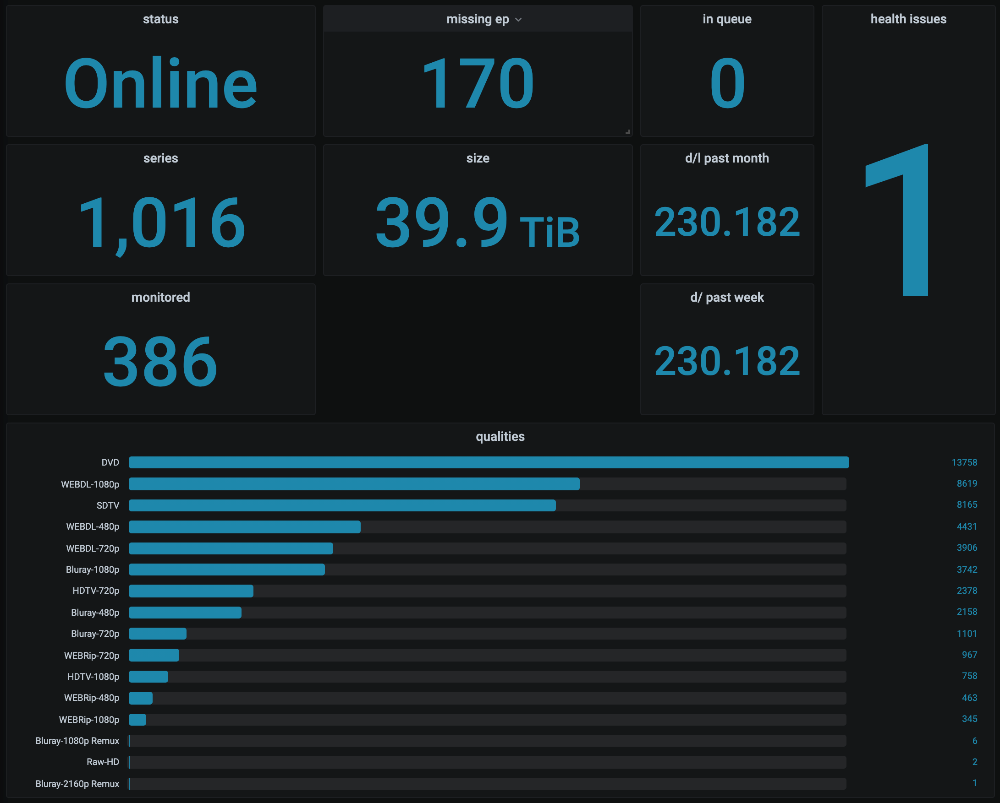

# exportarr

AIO Prometheus Exporter for Sonarr, Radarr or Lidarr

[](https://goreportcard.com/report/github.com/onedr0p/exportarr)

This is Prometheus Exporter will export metrics gathered from Sonarr,
Radarr, Lidarr, Prowlarr, and Readarr (experimental). This only supports v1 API of Lidarr, Prowlarr, and Readarr
and v3 APIs for Sonarr and Radarr. It will not gather metrics from all 3 at once,
and instead you need to tell the exporter what metrics you want. Be sure
to see the examples below for more information.



## Usage

### Run with Docker Compose

See examples in the [examples/compose](./examples/compose/) directory

### Run with Kubernetes

See examples in the [examples/kubernetes](./examples/kubernetes/)
directory.

This exporter is also included in the Lidarr, Radarr, Sonarr, and Prowlarr helm
charts located over at
[k8s-at-home/charts](https://github.com/k8s-at-home/charts)

### Run with Docker CLI

#### Sonarr
```bash
docker run --name exportarr_sonarr \
  -e PORT=9707 \
  -e URL="http://x.x.x.x:8989" \
  -e APIKEY="amlmndfb503rfqaa5ln5hj5qkmu3hy18" \
  --restart unless-stopped \
  -p 9707:9707 \
  -d ghcr.io/onedr0p/exportarr:latest sonarr
```

Visit http://127.0.0.1:9707/metrics to see Sonarr metrics

#### Radarr

```bash
docker run --name exportarr_radarr \
  -e PORT=9708 \
  -e URL="http://x.x.x.x:7878" \
  -e APIKEY="zmlmndfb503rfqaa5ln5hj5qkmu3hy19" \
  --restart unless-stopped \
  -p 9708:9708 \
  -d ghcr.io/onedr0p/exportarr:v1.0.0 radarr
```

Visit http://127.0.0.1:9708/metrics to see Radarr metrics

#### Lidarr

```bash
docker run --name exportarr_lidarr \
  -e PORT=9709 \
  -e URL="http://x.x.x.x:8686" \
  -e APIKEY="zmlmndfb503rfqaa5ln5hj5qkmu3hy19" \
  --restart unless-stopped \
  -p 9709:9709 \
  -d ghcr.io/onedr0p/exportarr:v1.0.0 lidarr
```

Visit http://127.0.0.1:9709/metrics to see Lidarr metrics

#### Prowlarr

```bash
docker run --name exportarr_prowlarr \
  -e PORT=9710 \
  -e URL="http://x.x.x.x:9696" \
  -e APIKEY="zmlmndfb503rfqaa5ln5hj5qkmu3hy19" \
  --restart unless-stopped \
  -p 9710:9710 \
  -d ghcr.io/onedr0p/exportarr:v1.0.0 prowlarr
```

Visit http://127.0.0.1:9710/metrics to see Prowlarr metrics

### Readarr (Experimental)

```bash
docker run --name exportarr_readarr \
  -e PORT=9711 \
  -e URL="http://x.x.x.x:9797" \
  -e APIKEY="zmlmndfb503rfqaa5ln5hj5qkmu3hy19" \
  --restart unless-stopped \
  -p 9711:9711 \
  -d ghcr.io/onedr0p/exportarr:v1.0.0 readarr
```

Visit http://127.0.0.1:9711/metrics to see Readarr metrics
### Run from the CLI

#### Sonarr

```sh
./exportarr sonarr --help

./exportarr sonarr \
  --port 9707 \
  --url http://x.x.x.x:8989 \
  --api-key amlmndfb503rfqaa5ln5hj5qkmu3hy18
```

Visit http://127.0.0.1:9707/metrics to see Sonarr metrics

#### Radarr

```sh
./exportarr radarr --help

./exportarr radarr \
  --port 9708 \
  --url http://x.x.x.x:7878 \
  --api-key amlmndfb503rfqaa5ln5hj5qkmu3hy18
```

Visit http://127.0.0.1:9708/metrics to see Radarr metrics

#### Lidarr

```sh
./exportarr lidarr --help

./exportarr lidarr \
  --port 9709 \
  --url http://x.x.x.x:8686 \
  --api-key amlmndfb503rfqaa5ln5hj5qkmu3hy18
```

Visit http://127.0.0.1:9709/metrics to see Radarr metrics

#### Prowlarr

```sh
./exportarr prowlarr --help

./exportarr prowlarr \
  --port 9710 \
  --url http://x.x.x.x:9696 \
  --api-key amlmndfb503rfqaa5ln5hj5qkmu3hy18
```

#### Readarr (Experimental)

```sh
./exportarr readarr --help

./exportarr readarr \
  --port 9711 \
  --url http://x.x.x.x:9696 \
  --api-key amlmndfb503rfqaa5ln5hj5qkmu3hy18
```

Visit http://127.0.0.1:9710/metrics to see Prowlarr metrics

## Configuration

| Environment Variable         | CLI Flag                       | Description                                                    | Default   | Required |
|:----------------------------:|--------------------------------|----------------------------------------------------------------|-----------|:--------:|
| `PORT`                       | `--port` or `-p`               | The port exportarr will listen on                              |           | ✅       |
| `URL`                        | `--url` or `-u`                | The full URL to Sonarr, Radarr, or Lidarr                      |           | ✅       |
| `APIKEY`                     | `--api-key` or `-a`            | API Key for Sonarr, Radarr or Lidarr                           |           | ❌       |
| `APIKEY_FILE`                | `--api-key-file`               | API Key file location for Sonarr, Radarr or Lidarr             |           | ❌       |
| `CONFIG`                     | `--config` or `-c`             | Path to Sonarr, Radarr or Lidarr's `config.xml` (advanced)     |           | ❌       |
| `INTERFACE`                  | `--interface` or `-i`          | The interface IP exportarr will listen on                      | `0.0.0.0` | ❌       |
| `LOG_LEVEL`                  | `--log-level` or `-l`          | Set the default Log Level                                      | `INFO`    | ❌       |
| `DISABLE_SSL_VERIFY`         | `--disable-ssl-verify`         | Set to `true` to disable SSL verification                      | `false`   | ❌       |
| `BASIC_AUTH_PASSWORD`        | `--basic-auth-password`        | Set to your basic auth password                                |           | ❌       |
| `BASIC_AUTH_USERNAME`        | `--basic-auth-username`        | Set to your basic auth username                                |           | ❌       |
| `ENABLE_ADDITIONAL_METRICS`  | `--enable-additional-metrics`  | Set to `true` to enable gathering of additional metrics (slow) | `false`   | ❌       |
| `ENABLE_UNKNOWN_QUEUE_ITEMS` | `--enable-unknown-queue-items` | Set to `true` to enable gathering unknown queue items          | `false`   | ❌       |

### Prowlarr Backfill

The prowlarr collector is a little different than other collectors as it's hitting an actual "stats" endpoint, collecting counters of events that happened in a small time window, rather than getting all-time statistics like the other collectors. This means that by default, when you start the prowlarr collector, collected stats will start from that moment (all counters will start from zero). `ENABLE_ADDITIONAL_METRIC` will tell the collector that it should backfill all-time metrics the first time it's queried. The actual API call this makes is *really* slow. On my prowlarr instance which is only a few months old, this took more than 5 seconds, so if you have a very active or very old prowlarr server this might time out, and need to be turned off.

Note that if you have to turn off backfill that your counters will reset to zero every time you restart the collector. This isn't a huge problem, prometheus expects counters to reset on restart, so normal aggregations like `rate()`, `increase()`, `irate()`, etc will all still work fine. The only thing that will be tough will be getting all-time stats (you can still do it, but you'll have to do something like `increase(stat_you_want_to_see[<timeserverhasbeenalive>])`, which will likely be slow)