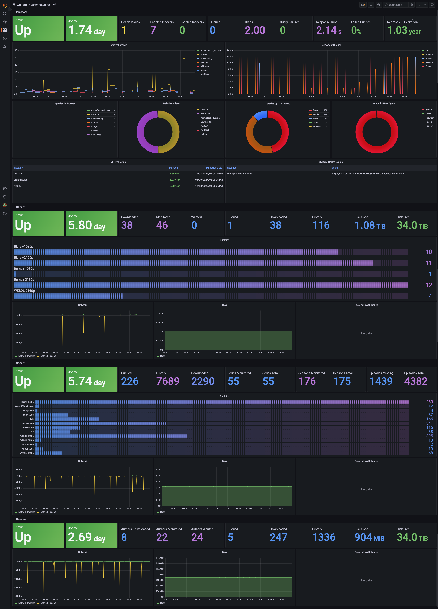

# Exportarr

AIO Prometheus Exporter for Sonarr, Radarr, Lidarr, Prowlarr, Bazarr and Sabnzbd

[](https://goreportcard.com/report/github.com/onedr0p/exportarr)

Note: This exporter will not gather metrics from all apps at once. You will need an `exportarr` instance for each app. Be sure to see the examples below for more information.



## Usage

### Docker Compose

See examples in the [examples/compose](./examples/compose/) directory.

### Kubernetes

See examples in the [examples/kubernetes](./examples/kubernetes/) directory.

### Docker CLI

_Replace `$app`, `$port` and `$apikey` with one of the supported apps, port and api key_

```sh
# PORT must be unique across all Exportarr instances
docker run --name exportarr_$app \
  -e PORT=9707 \
  -e URL="http://x.x.x.x:$port" \
  -e API_KEY="$apikey" \
  --restart unless-stopped \
  -p 9707:9707 \
  -d ghcr.io/onedr0p/exportarr:latest $app
```

Visit http://127.0.0.1:9707/metrics to see the app metrics

### CLI

_Replace `$app`, `$port` and `$apikey` with one of the supported apps, port and api key_

```sh
./exportarr $app --help

# --port must be unique across all Exportarr instances
./exportarr $app \
  --port 9707 \
  --url "http://x.x.x.x:$port" \
  --api-key "$apikey"
```

Visit http://127.0.0.1:9707/metrics to see the app metrics

## Configuration

|        Environment Variable        | CLI Flag                       | Description                                                                                                               | Default              | Required |
| :--------------------------------: | ------------------------------ | ------------------------------------------------------------------------------------------------------------------------- | -------------------- | :------: |
|               `PORT`               | `--port` or `-p`               | The port Exportarr will listen on                                                                                         | `8081`               |    ❌    |
|               `URL`                | `--url` or `-u`                | The full URL to the app being exported                                                                                    |                      |    ✅    |
|             `API_KEY`              | `--api-key` or `-a`            | API Key for the app being exported                                                                                        |                      |    ✅    |
|           `API_KEY_FILE`           | —                              | Path to a file containing the API key (Docker/Kubernetes secrets); overrides `API_KEY`                                    |                      |    ❌    |
|            `INTERFACE`             | `--interface` or `-i`          | The interface IP Exportarr will listen on                                                                                 | `0.0.0.0`            |    ❌    |
|            `LOG_LEVEL`             | `--log-level` or `-l`          | Log level (`debug`, `info`, `warn`, `error`)                                                                              | `info`               |    ❌    |
|            `LOG_FORMAT`            | `--log-format`                 | Log format (`console`, `json`)                                                                                            | `console`            |    ❌    |
|        `DISABLE_SSL_VERIFY`        | `--disable-ssl-verify`         | Set to `true` to disable SSL verification                                                                                 | `false`              |    ❌    |
|         `REQUEST_TIMEOUT`          | `--request-timeout`            | HTTP timeout per request to the target app                                                                                | `60s`                |    ❌    |
|          `AUTH_PASSWORD`           | `--auth-password`              | Password for form auth                                                                                                    |                      |    ❌    |
|          `AUTH_USERNAME`           | `--auth-username`              | Username for form auth                                                                                                    |                      |    ❌    |
|            `FORM_AUTH`             | `--form-auth`                  | Use form-based authentication                                                                                             | `false`              |    ❌    |
|    `ENABLE_UNKNOWN_QUEUE_ITEMS`    | `--enable-unknown-queue-items` | Set to `true` to enable gathering unknown queue items                                                                     | `false`              |    ❌    |
|     `DISABLE_QUALITY_METRICS`      | `--disable-quality-metrics`    | Skip per-item quality breakdowns (episodefile/trackfile lookups; ~1 API call per series/artist each scrape)               | `false`              |    ❌    |
|     `DISABLE_EPISODE_METRICS`      | `--disable-episode-metrics`    | Skip per-episode metrics (sonarr episode monitoring, bazarr episode-subtitle walk; load scales with library size)         | `false`              |    ❌    |
|      `DISABLE_ALBUM_METRICS`       | `--disable-album-metrics`      | Skip per-album metrics (lidarr album lookups; ~1 API call per artist each scrape)                                         | `false`              |    ❌    |
|     `DISABLE_HISTORY_METRICS`      | `--disable-history-metrics`    | Skip the history endpoint — its total forces a full count over the unprunable history table, slow on multi-year instances | `false`              |    ❌    |
|      `DISABLE_WANTED_METRICS`      | `--disable-wanted-metrics`     | Skip the wanted/missing and wanted/cutoff endpoints — their totals force full counts, slow on very large libraries        | `false`              |    ❌    |
|        `PROWLARR__BACKFILL`        | `--backfill`                   | Set to `true` to enable backfill of historical metrics                                                                    | `false`              |    ❌    |
|  `PROWLARR__BACKFILL_SINCE_DATE`   | `--backfill-since-date`        | Set a date (`YYYY-MM-DD`) from which to start the backfill                                                                | `1970-01-01` (epoch) |    ❌    |
|    `BAZARR__SERIES_BATCH_SIZE`     | `--series-batch-size`          | Number of series per Bazarr episodes API call                                                                             | `300`                |    ❌    |
| `BAZARR__SERIES_BATCH_CONCURRENCY` | `--series-batch-concurrency`   | Concurrent Bazarr episodes API calls                                                                                      | `10`                 |    ❌    |

### Prowlarr Backfill

The Prowlarr collector is a little different than other collectors as it's hitting an actual "stats" endpoint, collecting counters of events that happened in a small time window, rather than getting all-time statistics like the other collectors. This means that by default, when you start the Prowlarr collector, collected stats will start from that moment (all counters will start from zero).

To backfill all Prowlarr Data, either use `PROWLARR__BACKFILL` or `--backfill`.

Note that the first request can be extremely slow, depending on how long your Prowlarr instance has been running. You can also specify a start date to limit the backfill if the backfill is timing out:

`PROWLARR__BACKFILL_SINCE_DATE=2023-03-01` or `--backfill-since-date=2023-03-01`

## Scrape performance and sizing

Measured against real instances with **every metric enabled** — use these scaling rules to pick scrape intervals and container limits:

| App      | Typical scrape       | What it scales with                                                                                                                         |
| -------- | -------------------- | ------------------------------------------------------------------------------------------------------------------------------------------- |
| SABnzbd  | tens of milliseconds | flat — two small API calls                                                                                                                  |
| Radarr   | a second or two      | one large movie-list payload; mostly JSON transfer + decode                                                                                 |
| Sonarr   | a few seconds        | per-series fan-out (two API calls per series, 10 concurrent)                                                                                |
| Lidarr   | a few seconds        | per-artist fan-out (two API calls per artist, 10 concurrent)                                                                                |
| Prowlarr | fast                 | stats endpoint (see the backfill note above for the first scrape)                                                                           |
| Bazarr   | tens of seconds      | full episode-subtitle walk; the time is spent _inside bazarr_ generating the batched responses, so batch/concurrency tuning barely moves it |

- **Set `scrape_interval` longer than your worst scrape.** Bazarr with episode metrics enabled commonly needs `60s` or more; if a scrape arrives while the previous one is still running, exportarr skips it and raises the collector's error gauge (see "Changed scrape behavior" below). The other apps are comfortable at `15–30s`.
- The first scrape after startup is the slowest (TLS handshakes); connections are pooled and reused afterwards.
- **Memory** scales with the largest API payload decoded: expect roughly 25–100 MB RSS, with the high end during bazarr's episode walk or a large radarr movie list. In Kubernetes, set `GOMEMLIMIT` to the container memory limit so GC stays ahead of the decode spike, and watch the exporter's own `go_*`/`process_*` metrics.
- If a scrape is too slow, reach for the `DISABLE_*` flags above rather than a shorter `REQUEST_TIMEOUT` — they remove the expensive endpoints entirely instead of cutting requests off mid-flight.

## Upgrading from v2 to v3

v3 is a breaking release. Review each section before upgrading.

### Removed

- **Readarr support** — the `readarr` command, its metrics, and its dashboard panels are gone (Readarr was retired upstream).
- **Basic auth** — HTTP basic auth and the `--basic-auth-username`/`--basic-auth-password` flags are removed. `AUTH_USERNAME`/`AUTH_PASSWORD` now apply to form auth only and require `FORM_AUTH=true`; setting credentials without form auth is a startup error.
- **config.xml parsing** — `CONFIG`/`--config` is removed; exportarr no longer reads the \*arr's config file. Provide the key via `API_KEY`/`--api-key`, or `API_KEY_FILE` (environment-only) for Docker and Kubernetes secrets mounted as files.
- **Legacy variable aliases** — `APIKEY`, `APIKEY_FILE`, `BASIC_AUTH_USERNAME` and `BASIC_AUTH_PASSWORD` no longer work.
- **Log levels** — `fatal`, `panic` and `dpanic` are gone; valid levels are `debug`, `info`, `warn`, `error`.
- **`ENABLE_ADDITIONAL_METRICS`** — removed. The metrics it bundled are now collected **by default** (the per-item fan-out is parallelized and ~10× faster), with granular opt-outs instead: `DISABLE_QUALITY_METRICS`, `DISABLE_EPISODE_METRICS`, `DISABLE_ALBUM_METRICS`. Set all that apply to restore v2's default-off behavior.

| v2                                   | v3                                                                                         |
| ------------------------------------ | ------------------------------------------------------------------------------------------ |
| `APIKEY`                             | `API_KEY`                                                                                  |
| `API_KEY_FILE=/path`                 | unchanged — still supported (Docker/Kubernetes secrets)                                    |
| `CONFIG=/path/config.xml`            | `URL` + `API_KEY`                                                                          |
| `BASIC_AUTH_USERNAME`/`..._PASSWORD` | removed — form auth uses `AUTH_USERNAME`/`AUTH_PASSWORD` + `FORM_AUTH=true`                |
| `LOG_LEVEL=fatal`                    | `LOG_LEVEL=error`                                                                          |
| `ENABLE_ADDITIONAL_METRICS=true`     | (default behavior — remove it)                                                             |
| `ENABLE_ADDITIONAL_METRICS` unset    | `DISABLE_QUALITY_METRICS` + `DISABLE_EPISODE_METRICS` + `DISABLE_ALBUM_METRICS` all `true` |

### Changed scrape behavior — update your alerts

- A failing collector no longer fails the whole scrape with HTTP 500. `/metrics` now returns 200 with everything that succeeded, plus a per-collector error gauge (e.g. `radarr_collector_error`, `radarr_queue_collector_error`) set to `1` for whatever failed. Alerts that relied on the target reporting `up == 0` when the app was down should alert on `*_collector_error > 0` instead.
- `sabnzbd_collector_error` renamed its `target` label to `url`, matching every other metric.
- Overlapping collections are skipped: if a scrape arrives while the previous sonarr/lidarr/bazarr collection is still running against a slow instance, exportarr skips it (raising the collector's error gauge) instead of stacking concurrent walks onto the app — the failure mode behind bazarr CPU drainage ([#380](https://github.com/onedr0p/exportarr/issues/380)).

### Changed metrics

- `bazarr_subtitles_score_total{score="93.45%"}` (one series per distinct score — unbounded cardinality) is replaced by a **histogram**, `bazarr_subtitles_score`, with percentage buckets `10..90, 95, 100`. Use `histogram_quantile()` or the bucket series directly ([#239](https://github.com/onedr0p/exportarr/issues/239)).
- `<app>_queue_total` now emits one series per `(status, download_status, download_state)` combination with accurate counts. An empty queue emits a single zero series (empty label values) instead of no series at all, so dashboards can tell "zero items" from "scrape failed". v2 emitted a single series carrying the total queue size under whichever labels the last queue item happened to have — sums still work, per-label panels will show corrected values.
- The self-instrumentation duration gauges (`<app>_scrape_duration_seconds`, `sabnzbd_queue_query_duration_seconds`, `sabnzbd_server_stats_query_duration_seconds`) are now **histograms**, so `histogram_quantile()` works across scrapes instead of only seeing the last value. They additionally expose sparse **native histograms** to scrapers that negotiate them; classic buckets remain for everyone else.
- Log output is structured slog (`time=… level=… msg=…`, or JSON with `--log-format json`); update anything parsing exporter logs.

### New in v3

No action needed, but worth knowing:

- `<app>_diskspace_free_bytes` / `<app>_diskspace_total_bytes` (per disk, with totals — disk usage is finally computable).
- `sabnzbd_speed_limit_bps` / `sabnzbd_speed_limit_percent`.
- `bazarr_throttled_providers` and `bazarr_signalr_connected{app="sonarr"|"radarr"}`.
- `bazarr_episode_subtitles_missing_total` stays exported even with `DISABLE_EPISODE_METRICS=true` (sourced from bazarr's cheap badges endpoint), and `bazarr_subtitles_missing_total` always includes the episode count instead of misleadingly reporting movies-only ([#407](https://github.com/onedr0p/exportarr/issues/407)).
- `REQUEST_TIMEOUT` / `--request-timeout` (default `60s`) caps each request to the target app.
- Huge-library relief: `DISABLE_HISTORY_METRICS` and `DISABLE_WANTED_METRICS` skip the endpoints whose totals force full table counts (the queries that can hang a multi-year instance's UI during scrapes). Combined with v3's `pageSize=1`, no-sort requests and partial scrapes, large sonarr/radarr instances scrape reliably again.
- Resiliency: a panic inside any collector — including concurrent fan-out workers — now degrades to that collector's error gauge instead of crashing the exporter, and scraping an empty instance (e.g. bazarr with no series, [#244](https://github.com/onedr0p/exportarr/issues/244)) is clean.
- Retries of failed requests now back off with jitter (~250ms, then ~500ms) instead of re-sending immediately, giving a struggling instance breathing room.
- The exporter exposes its own runtime metrics (`go_*`, `process_*`), so its CPU, memory, and GC behavior are visible alongside the app metrics.
- Large-library scrapes are dramatically faster: per-series/artist lookups now run concurrently, and the per-item metrics on a ~500-series library drop from ~30s to a few seconds.
