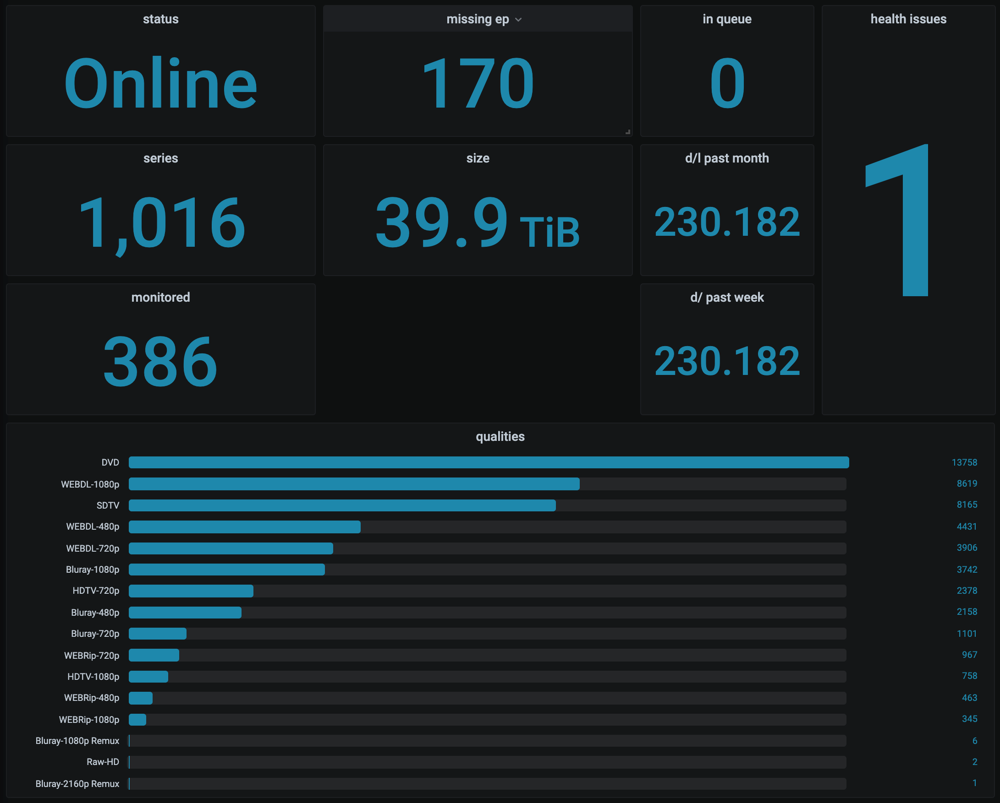

# Dashboard Examples

# Dashboard 1

[Dashboard 1](./dashboard.json) covers Radarr -- this is the image which is displayed on the main README.

# Dashboard 2

[Dashboard 2](./dashboard2.json) covers Prowlarr, Sabnzbd, Radarr, Sonarr, Lidarr, Readarr.

Notes:
- This dashboard was built assuming these services are running kubernetes, so the `Uptime` and `Network` panels assume kubernetes prometheus metrics are available. In other environments these will need to be delete/edited.
